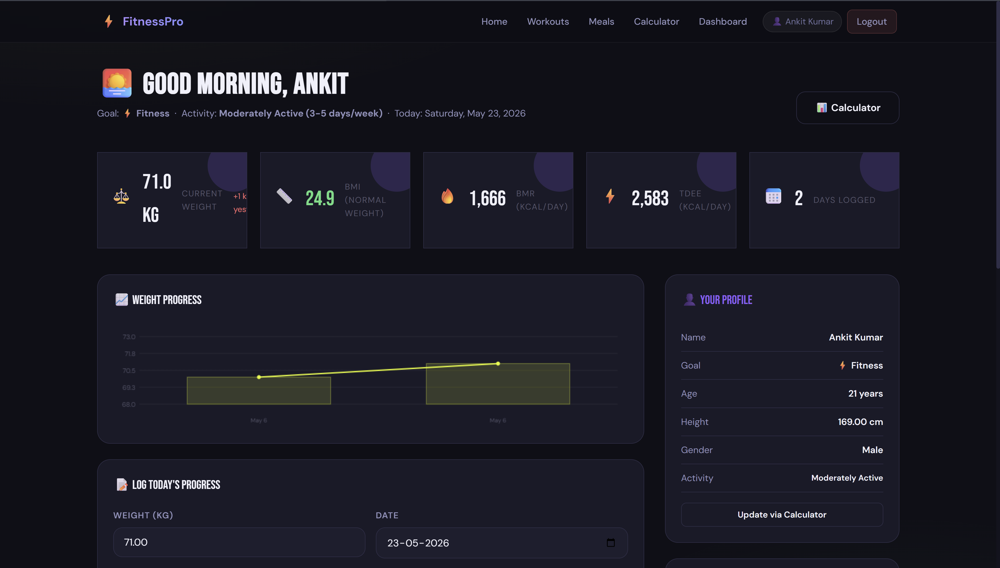

# Fitness Planner 💪

A modern Fitness Planner web application developed using PHP, MySQL, HTML, CSS, and JavaScript.

## Features
- User Authentication
- Workout Management
- Meal Planning
- Admin Dashboard
- Category Management
- Responsive Design

## Technologies Used
- PHP
- MySQL
- HTML5
- CSS3
- JavaScript

## Project Screenshots

### Dashboard

### Meals Page

### Progress Tracker

### BMI Calculator

## Author
Ankit Singh
